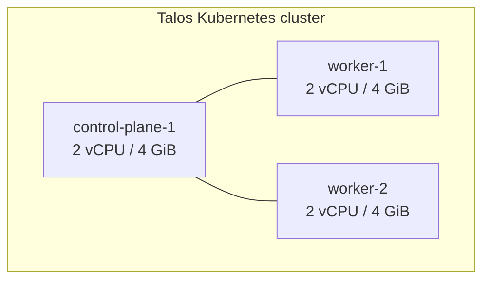

# Cluster

> Status: `Planned`. See [ADR-001](../adr/001-runtime-talos-linux.md) and
> [ADR-002](../adr/002-cluster-topology.md).

## Host

| Property | Value |
|---|---|
| Machine | Cluster host (`lab-host`) — Apple Silicon (M4), 14 vCPU / 24 GiB RAM |
| OS | macOS (host only; Kubernetes runs inside Talos Linux VMs) |
| Access | Tailscale (private tailnet) + SSH |
| VM driver | `talosctl cluster create` (QEMU, scriptable) |

## Topology

One control-plane node and two workers. Single control-plane means a single etcd
member — an accepted trade-off documented in [ADR-002](../adr/002-cluster-topology.md);
the upgrade path is a 3-node control plane.

## Node storage

Workloads use Talos' local path by default. There is **no replicated storage** —
replication is deliberately out of scope for a single-host cluster; durability is
handled by backups ([ADR-010](../adr/010-backup-restic-local.md)).

## Networking

- Pod/service networking: default CNI. Network **policy** enforcement comes from
  Cilium ([ADR-012](../adr/012-security-baseline.md)).
- Operator access and admin APIs: Tailscale only.
- Public traffic: Cloudflare Tunnel only ([ADR-008](../adr/008-public-dashboard-cloudflare-tunnel.md)).

## Cluster access (runbooks)

- Get kubeconfig: `talosctl kubeconfig ./kubeconfig`
- Check node health: `talosctl health`
- Upgrade Talos: see [`runbooks/talos-upgrade.md`](../runbooks/talos-upgrade.md)

## Cluster secrets

`talosconfig` and Talos machine secrets are **never committed**. They live
outside the repository and are backed up encrypted. Only Sealed Secrets
ciphertext enters Git ([ADR-005](../adr/005-secrets-sealed-secrets.md)).
