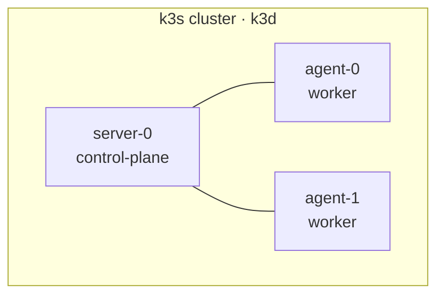

# Cluster

> Status: `Running`. Phase 1 complete — see [ADR-016](../adr/016-runtime-k3s-k3d.md)
> and [ADR-002](../adr/002-cluster-topology.md).

## Host

| Property | Value |
|---|---|
| Machine | Cluster host (`lab-host`) — Apple Silicon (M4), 14 vCPU / 24 GiB RAM |
| OS | macOS (host only; Kubernetes runs inside a Colima Linux VM) |
| Access | Tailscale (private tailnet) + SSH |
| Container runtime | Colima (macOS Virtualization.Framework) |
| Docker endpoint | `unix://$HOME/.colima/default/docker.sock` |
| Cluster runtime | k3s via k3d |

Installed versions: `k3s v1.35.5+k3s1`, `containerd 2.2.3-k3s1`, `k3d v5.9.0`,
Colima `0.10.3`.

## Topology

One control-plane server and two agents. The node count matches
[ADR-002](../adr/002-cluster-topology.md); the runtime is k3s via k3d.



## Storage

k3s' default **local-path** provisioner. There is no replicated storage —
replication is out of scope for a single host; durability is handled by backups
([ADR-010](../adr/010-backup-restic-local.md)).

## Networking

- **CNI:** k3s default (flannel). k3s' built-in NetworkPolicy support is limited;
  policy-capable networking (Cilium) is planned per
  [ADR-012](../adr/012-security-baseline.md).
- **Ingress:** the bundled Traefik is disabled at bootstrap
  (`--disable=traefik@server:0`); ingress is installed declaratively through
  Argo CD ([ADR-006](../adr/006-ingress-traefik.md)).
- **Ports:** 80/443 are mapped to the k3d load balancer.
- **Operator access:** Tailscale only. **Public:** Cloudflare Tunnel only
  ([ADR-008](../adr/008-public-dashboard-cloudflare-tunnel.md)).

## Cluster access

```bash
export DOCKER_HOST="unix://$HOME/.colima/default/docker.sock"
kubectl config use-context k3d-homelab
kubectl get nodes
k3d cluster list
k3d cluster stop homelab   # / k3d cluster start homelab
```

## Cluster secrets

There is no `talosconfig` (the runtime is k3s via k3d). The kubeconfig lives in
the operator's `~/.kube/config` and is **never committed**. Application secrets
are `SealedSecret` resources ([ADR-005](../adr/005-secrets-sealed-secrets.md)).
