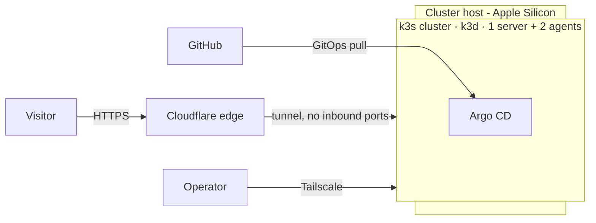

# Architecture Overview

> Status: `Running`. This page describes the system as built; components carry
> their own state where they diverge.

## Purpose

A **production-grade SRE homelab**: a single-cluster Kubernetes environment built
and operated with the practices you would expect in production — GitOps,
observability, SLOs, and documented decisions. It doubles as a public showcase:
the **repository** and the **status page** are public, while dashboards and the
demo API stay private
([ADR-020](../adr/020-grafana-private.md), [ADR-022](../adr/022-demo-api-tailnet-only.md)).

This cluster is **run 1** — a deliberate pilot
([ADR-025](../adr/025-run-1-pilot.md)). It was built to surface problems and
settle decisions before a clean rebuild; what went wrong, and what run 2 should
do differently, is recorded in
[`lessons-learned.md`](../lessons-learned.md).

## Context

## Components

| Layer | Component | State |
|---|---|---|
| Runtime | k3s via k3d (1 server + 2 agents) | Running |
| GitOps | Argo CD | Running |
| Ingress | Traefik | Running |
| Secrets | Sealed Secrets | Running |
| Observability | Prometheus, Loki, Grafana, Tempo, OpenTelemetry, Alloy | Running |
| Status | Gatus (status page as code) | Running |
| Public edge | Cloudflare Tunnel | Running |
| Demo workload | Go CRUD service + PostgreSQL, OTel-instrumented | Running |
| Alerts | Alertmanager → Telegram (page/ticket) | Planned |
| Backup | Restic → local disk (B2 deferred) | Planned |
| IaC | OpenTofu (Cloudflare DNS, Tailscale) | Running |

## Design principles

- **No inbound ports.** Everything public goes out through a tunnel; operator
  access is over Tailscale.
- **Declarative by default.** Cluster state is described in Git and reconciled by
  Argo CD. Imperative access is an exception, documented in a runbook.
- **Symptoms over causes.** Alerts fire on what users feel (error rate, latency,
  availability), not on raw resource levels.
- **Backups are tested.** A backup that has never been restored is not a backup.
- **Decisions are written down.** See [`adr/`](adr/).
