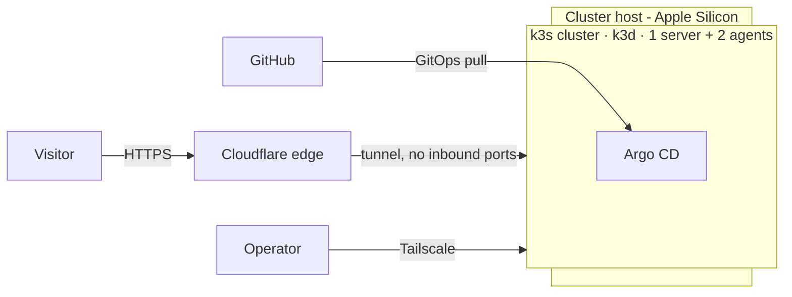

# Architecture Overview

> Status: `Planned` — this describes the target system. Components are marked
> with their implementation state as they land.

## Purpose

A **production-grade SRE homelab**: a single-cluster Kubernetes environment built
and operated with the practices you would expect in production — immutable OS,
GitOps, observability, SLOs, tested backups, and documented decisions. It doubles
as a public showcase: the repository, the dashboards, and the status page are all
visible.

## Context

## Components

| Layer | Component | State |
|---|---|---|
| Runtime | k3s via k3d (1 server + 2 agents) | Running |
| GitOps | Argo CD | Running |
| Ingress | Traefik | Planned |
| Secrets | Sealed Secrets | Planned |
| Observability | Prometheus, Loki, Grafana, Tempo, OpenTelemetry, Alloy | Running |
| Status | Uptime Kuma | Running |
| Public edge | Cloudflare Tunnel | Running |
| Demo workload | Go CRUD service + PostgreSQL, OTel-instrumented | Planned |
| Alerts | Alertmanager → Telegram (page/ticket) | Planned |
| Backup | Restic → local disk (B2 deferred) | Planned |
| IaC | OpenTofu (Cloudflare DNS, Tailscale) | Planned |

## Design principles

- **No inbound ports.** Everything public goes out through a tunnel; operator
  access is over Tailscale.
- **Declarative by default.** Cluster state is described in Git and reconciled by
  Argo CD. Imperative access is an exception, documented in a runbook.
- **Symptoms over causes.** Alerts fire on what users feel (error rate, latency,
  availability), not on raw resource levels.
- **Backups are tested.** A backup that has never been restored is not a backup.
- **Decisions are written down.** See [`adr/`](adr/).
